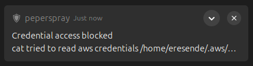
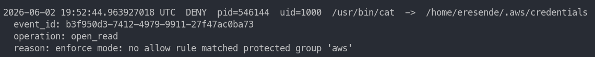
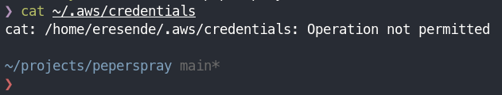

# peperspray

`peperspray` is a Linux-first credential access guard for developer
workstations.

The current MVP is a root-owned daemon that uses Linux `fanotify` permission
events to detect protected credential-file reads and block them before they
complete unless an explicit policy rule allows the access.

This repository is currently a **personal production / dogfood MVP** for Ubuntu
24.04 and Fedora/RHEL-family developer workstations. It includes host-level read
enforcement, packaging, service management, logs, policy review, and desktop
notifications, while still carrying documented hardening gaps around tamper
resistance:

- TOML configuration parsing and logical validation
- protected users and protected credential path groups
- allow-rule based policy decisions
- learn/enforce decision behavior
- path normalization and `~` expansion for protected paths
- optional operation and parent-process constraints on allow rules
- Linux `/proc` process inspection
- JSONL decision logs with timestamps and event IDs
- log inspection, filtering, following, JSON output, and event lookup
- learned-access review and suggested allow-rule generation
- starter and interactive config generation through `setup`
- human and JSON status output
- root-owned Linux daemon with `fanotify` read enforcement
- `.deb` and RPM packaging, systemd service, log rotation, and denied-access
  desktop notifications

## Design Target

The target product is described in [docs/SPEC.md](docs/SPEC.md). In short:

- `pepersprayd` runs as a root-owned `systemd` service on Linux systems with
  fanotify permission-event support.
- `peperspray` will manage setup, status, modes, logs, testing, and policy
  review.
- Default posture is zero-trust in enforce mode: protected credential reads are
  denied unless an allow rule matches.
- Learn mode records accesses that would have been denied without blocking them.
- Platform-neutral policy, event, process, and logging types are kept separate
  from Linux-specific event collection where practical.

## Current Status

Implemented commands:

- `setup`
- `status`
- `learn`
- `enforce`
- `service status`
- `service start`
- `service stop`
- `service restart`
- `policy-validate`
- `test-access`
- `inspect-process`
- `logs`
- `why`
- `policy-review`

Implemented policy and CLI capabilities:

- Config loading from TOML
- Config validation beyond syntax, including:
  - unknown protected groups
  - duplicate protected group names
  - duplicate allow-rule names
  - duplicate allow-rule behavior
- Learn/enforce policy decisions
- Protected path matching using component-aware `Path::starts_with`, plus
  inode/device identity matching for protected file aliases
- Path normalization for config and access events
- `~` expansion for protected group paths
- Optional `operation` field on allow rules
- Optional `parent_exe` field on allow rules
- Optional `exe_sha256` executable hash pin on allow rules
- Process inspection from `/proc/<pid>`
- Parent-process chain collection
- JSONL decision logs
- Log filtering by decision, count, and timestamp
- Log following
- Single-event lookup by event ID or latest matching event
- Policy-review suggestions as human text, JSON, TOML, or suggestion file,
  with minimum-event filtering
- Starter and interactive config generation with detected local tools
- Safe mode changes with config backups
- Protected preset discovery with the `dev-browser-wallet` default profile
- Expanded protected presets for developer credentials, browser credential
  stores, wallets, and password managers
- Config v2 `protected_groups.patterns` for browser/profile path globs
- Split CLI/library layout with `peperspray` and `pepersprayd` binaries
- `pepersprayd` daemon with config validation, lifecycle JSONL logs, fanotify
  marks, and policy enforcement
- Linux `fanotify` permission-event loop, event conversion, decision logging,
  and FAN_ALLOW/FAN_DENY responses
- Privileged fanotify integration tests proving learn/enforce read behavior on
  Ubuntu 24.04
- Privileged path-identity regression tests proving hard-link, bind-mount, and
  mount-namespace aliases are blocked
- Service management wrappers around `systemctl`
- Installed-layout scaffolding under `packaging/`
- Local `.deb` package build script and Debian maintainer scripts
- Local RPM package build script and RPM spec for Fedora/RHEL-family systems
- Containerized RPM build wrapper for non-RPM hosts
- Remove/purge behavior for the installed service, config, and runtime log
- Installed logrotate policy for runtime log retention
- Best-effort desktop notifications for denied reads with in-memory throttling
- `doctor` health checks for backend availability, config validity, missing
  optional protected paths, and unsafe installed path permissions
- `policy-apply` for merging reviewed allow-rule suggestions with validation
  and config backups
- QEMU package lifecycle test for install, service startup, log permissions,
  upgrade permission repair, remove, and purge on Ubuntu 24.04
- QEMU RPM package lifecycle runner for Fedora/RHEL-family systems
- QEMU privileged integration runner for fanotify enforcement and path-identity
  regression tests on Ubuntu 24.04
- Documented path semantics and inode/device alias hardening
- Multi-architecture release builds for Linux x86_64 and ARM64 packages

Not implemented yet:

- daemon startup refusal for unsafe installed path permissions
- periodic rescan for newly created protected paths

## Requirements

- Rust toolchain with Cargo
- Linux is the intended platform
- The CLI can run normal simulated policy tests without root privileges.
- Host enforcement requires a root-owned daemon with Linux fanotify support.

## Build, Test, and Lint

```sh
cargo build
cargo test
cargo fmt
cargo clippy --all-targets -- -D warnings
```

The current test suite covers config validation, policy decisions, path handling,
process metadata parsing, log filtering/follow helpers, event lookup, setup
generation, status JSON, policy-review candidate grouping/output, and CLI
integration behavior.

## Configuration

The installed CLI and daemon default to the system config path:

```text
/etc/peperspray/config.toml
```

For local development examples, pass an explicit config path:

```sh
cargo run -- status --config examples/config.toml
```

A typical config looks like this:

```toml
mode = "learn"

[[users]]
uid = 1000
groups = ["aws", "ssh", "github", "gcloud", "docker", "npm", "ansible", "git", "dotenv"]

[[protected_groups]]
name = "aws"
paths = ["~/.aws"]

[[protected_groups]]
name = "ssh"
paths = ["~/.ssh"]

[[protected_groups]]
name = "github"
paths = ["~/.config/gh"]

[[protected_groups]]
name = "gcloud"
paths = ["~/.config/gcloud"]

[[protected_groups]]
name = "docker"
paths = ["~/.docker"]

[[protected_groups]]
name = "npm"
paths = ["~/.npmrc"]

[[protected_groups]]
name = "ansible"
paths = ["~/.ansible", "~/.ansible/vault_password"]

[[protected_groups]]
name = "git"
paths = ["~/.git-credentials", "~/.netrc"]

[[protected_groups]]
name = "dotenv"
paths = [".env", ".env.local", ".env.development", ".env.production"]

[[allow_rules]]
name = "Allow AWS CLI"
uid = 1000
exe = "/usr/bin/aws"
# exe_sha256 = "64-character sha256 digest"
path_group = "aws"
operation = "open_read"

[[allow_rules]]
name = "Allow SSH client"
uid = 1000
exe = "/usr/bin/ssh"
path_group = "ssh"
operation = "open_read"

[[allow_rules]]
name = "Allow Docker CLI"
uid = 1000
exe = "/usr/bin/docker"
path_group = "docker"
operation = "open_read"
```

Policy fields:

- `mode`: `learn` or `enforce`
- `users`: protected user IDs and the credential groups that apply to them
- `protected_groups`: named sets of protected paths and optional glob patterns
- `allow_rules`: explicit access rules

Allow-rule fields:

- `name`: human-readable rule name
- `uid`: protected user ID
- `exe`: executable path that is allowed
- `exe_sha256`: optional SHA-256 pin for the resolved executable
- `path_group`: protected group the executable may access
- `operation`: optional operation constraint; currently `open_read`
- `parent_exe`: optional parent executable constraint

If `exe_sha256` is set, the rule only matches when the resolved executable file
hash equals that digest. If it is omitted, the rule keeps the current path-only
executable matching behavior. `policy-review --toml` includes `exe_sha256` when
the logged executable is still readable.

If `operation` is omitted, the rule currently applies to any known operation.
Since the prototype only models `open_read`, generated rules include
`operation = "open_read"` for clarity.

If `parent_exe` is set, at least one parent process in the logged parent chain
must match that executable.

In `learn` mode, a protected access without a matching allow rule is allowed and
logged with:

```json
"would_deny": true
```

In `enforce` mode, the same access is denied.

If the daemon cannot inspect a short-lived process while handling a fanotify
event, learn mode allows the event and writes a daemon error record; enforce
mode keeps the conservative behavior and denies the event.

## CLI Usage

Run commands through Cargo during development.

### Generate a starter config

```sh
cargo run -- setup --output ./generated-config.toml
```

Overwrite an existing generated config:

```sh
cargo run -- setup --output ./generated-config.toml --force
```

Emit a JSON setup report:

```sh
cargo run -- setup --output ./generated-config.toml --force --json
```

Run interactive setup:

```sh
cargo run -- setup --output ./generated-config.toml --interactive
```

`setup` detects common tools in `PATH`, such as `aws`, `ssh`, `gh`, `gcloud`,
`docker`, `npm`, `ansible-vault`, `git`, browsers, and password-manager helpers,
and only generates allow rules for tools that are present. Some tools also add
known helper rules when the helper binary exists; for example Git adds
`/usr/lib/git-core/git`.

### List protected presets

```sh
cargo run -- presets
cargo run -- presets --json
```

The default profile is `dev-browser-wallet`, covering developer credentials,
browser credential stores, wallet data, and password-manager data.

### Change policy mode

```sh
cargo run -- learn --config ./generated-config.toml
cargo run -- enforce --config ./generated-config.toml
```

Mode changes validate the config first and write a `.bak` copy before replacing
the config.

### Validate daemon startup inputs

Validate the daemon config without starting the fanotify loop:

```sh
cargo run --bin pepersprayd -- \
  --config ./generated-config.toml \
  --log-file ./events.jsonl \
  --check
```

Installed-mode defaults are `/etc/peperspray/config.toml` and
`/var/log/peperspray/events.jsonl`. The systemd service starts the daemon as
root and marks existing absolute protected paths from the config. Protected
paths such as `~/.aws` are expanded against the configured protected user's home
directory, not root's home directory.

The experimental fanotify probe initializes a permission-event mark without
starting the full loop:

```sh
cargo run --bin pepersprayd -- \
  --config ./generated-config.toml \
  --log-file ./events.jsonl \
  --check \
  --fanotify-probe /path/to/protect
```

The fanotify loop reads `FAN_OPEN_PERM` events, converts each event
into an `AccessEvent`, evaluates policy, appends a JSONL decision log, and writes
`FAN_ALLOW` or `FAN_DENY` back to the kernel:

```sh
sudo target/debug/pepersprayd \
  --config ./generated-config.toml \
  --log-file ./events.jsonl \
  --fanotify-path /path/to/protect
```

When `--fanotify-path` is omitted, the daemon uses existing absolute paths from
`protected_groups`. Missing paths and relative filename presets such as `.env`
are skipped by the fanotify marker.

In enforce mode, denied reads trigger best-effort desktop notifications via
`notify-send` when the user's session bus is available. Notifications are
throttled per user, executable, protected group, and operation for five minutes
to avoid repeated popups from noisy tools. Denies are still blocked and logged
if desktop notifications are unavailable.



To run the ignored privileged fanotify tests on a Linux host:

```sh
cargo test --test privileged_fanotify --no-run
sudo "$(find target/debug/deps -maxdepth 1 -type f -executable -name 'privileged_fanotify-*' | head -n1)" --ignored --nocapture
```

To run the ignored privileged path-identity regression tests:

```sh
cargo test --test privileged_path_identity --no-run
sudo "$(find target/debug/deps -maxdepth 1 -type f -executable -name 'privileged_path_identity-*' | head -n1)" --ignored --nocapture
```

These tests assert that hard-link, bind-mount, and mount-namespace aliases for
protected files are blocked. If path-identity behavior changes, update the
expectations and `docs/PATH_SEMANTICS.md` together.

To run both ignored privileged test suites in an isolated Ubuntu 24.04 QEMU VM:

```sh
packaging/qemu-test-privileged.sh --image ./noble-server-cloudimg-amd64.img
```

The QEMU runner builds the test artifacts on the host, copies them into the VM,
and runs them as root with `PEPERSPRAYD_BIN` pointing at the copied daemon. The
runner uses KVM when `/dev/kvm` is available and falls back to TCG otherwise;
set `QEMU_ACCEL=kvm` or `QEMU_ACCEL=tcg` to force one mode.

### Manage installed service

These commands wrap `systemctl` for the installed `pepersprayd` service:

```sh
cargo run -- service status
sudo cargo run -- service start
sudo cargo run -- service stop
sudo cargo run -- service restart
```

The service is intended to run as root. Installed layout notes live in
`packaging/INSTALL_LAYOUT.md`.

Installed packages include `/etc/logrotate.d/peperspray` for
`/var/log/peperspray/events.jsonl`. The default policy rotates daily, rotates
early at 10 MiB, keeps 14 rotations, and compresses older logs.

### Build a local Debian package

```sh
packaging/build-deb.sh
cp ./target/debian/peperspray_0.1.2_amd64.deb /tmp/
sudo apt install /tmp/peperspray_0.1.2_amd64.deb
sudo apt remove peperspray
sudo apt purge peperspray
```

`packaging/build-deb.sh` builds for the host architecture by default. Set
`PEPERSPRAY_ARCH=arm64` when building on a Linux ARM64 host; release builds
publish both `amd64` and `arm64` Debian artifacts.

Validate the package lifecycle in a QEMU Ubuntu 24.04 VM:

```sh
packaging/qemu-test-deb.sh --image ./noble-server-cloudimg-amd64.img
```

See `docs/QEMU_PACKAGE_TESTING.md` for prerequisites, accelerator options, and
exact checks.

### Build a local RPM package

Build directly on a Fedora/RHEL-family host with `rpmbuild`:

```sh
packaging/build-rpm.sh
```

`packaging/build-rpm.sh` builds for the host architecture by default. Release
builds publish both `x86_64` and `aarch64` RPM artifacts.

Or build from an Ubuntu/Debian host through a Fedora container:

```sh
packaging/build-rpm-container.sh
```

Validate the RPM lifecycle in a QEMU Fedora VM:

```sh
packaging/qemu-test-rpm.sh --image ./Fedora-Cloud-Base.qcow2
```

### Show policy status

```sh
cargo run -- status
cargo run -- status --json
cargo run -- status --config ./generated-config.toml
```

### Validate a config

```sh
cargo run -- policy-validate
cargo run -- policy-validate --config examples/config.toml
```

### Run health checks

```sh
cargo run -- doctor
cargo run -- doctor --json
```

`doctor` checks backend availability, config parsing, installed config/log/binary
ownership and modes, and missing configured protected paths. Missing optional
preset paths are warnings; unsafe ownership or group/world-writable installed
paths are errors.

### Test a simulated access

Manual executable/UID input:

```sh
cargo run -- test-access ~/.aws/credentials \
  --exe /usr/bin/python3 \
  --uid 1000
```

PID-derived process metadata:

```sh
cargo run -- test-access ~/.aws/credentials --pid $$
```

Emit JSON for a decision:

```sh
cargo run -- test-access ~/.aws/credentials \
  --exe /usr/bin/python3 \
  --uid 1000 \
  --json
```

Append a decision to a JSONL log:

```sh
cargo run -- test-access ~/.aws/credentials \
  --exe /usr/bin/python3 \
  --uid 1000 \
  --log-file ./events.jsonl
```

### Inspect process metadata

```sh
cargo run -- inspect-process $$
```

This reads process metadata from `/proc`, including UID, executable, CWD,
command line, parent PID, and parent chain.

### Inspect logs

```sh
cargo run -- logs --log-file ./events.jsonl
cargo run -- logs --log-file ./events.jsonl --last 5
cargo run -- logs --log-file ./events.jsonl --decision allow
cargo run -- logs --log-file ./events.jsonl --decision deny
cargo run -- logs --log-file ./events.jsonl --since 2026-01-01T00:00:00Z
cargo run -- logs --log-file ./events.jsonl --follow
cargo run -- logs --log-file ./events.jsonl --json
```



### Explain one event

```sh
cargo run -- why <event-id> --log-file ./events.jsonl
cargo run -- why last --log-file ./events.jsonl
cargo run -- why last --decision deny --log-file ./events.jsonl
cargo run -- why <event-id> --log-file ./events.jsonl --json
```



### Review learned accesses

Human-readable review:

```sh
cargo run -- policy-review --log-file ./events.jsonl
```

JSON review output:

```sh
cargo run -- policy-review --log-file ./events.jsonl --json
```

TOML snippets only:

```sh
cargo run -- policy-review --log-file ./events.jsonl --toml
cargo run -- policy-review --log-file ./events.jsonl --min-events 3 --toml
```

Write TOML suggestions to a separate file:

```sh
cargo run -- policy-review \
  --log-file ./events.jsonl \
  --write-suggestions ./suggested-rules.toml
```

Overwrite an existing suggestion file:

```sh
cargo run -- policy-review \
  --log-file ./events.jsonl \
  --write-suggestions ./suggested-rules.toml \
  --force
```

`policy-review` never modifies the active config. It only suggests allow rules
based on learn-mode `would_deny` events.

Apply a reviewed suggestion file:

```sh
cargo run -- policy-apply \
  --suggestions ./suggested-rules.toml \
  --config ./generated-config.toml \
  --dry-run

cargo run -- policy-apply \
  --suggestions ./suggested-rules.toml \
  --config ./generated-config.toml \
  --force
```

`policy-apply` validates the merged config before replacing it and writes a
backup beside the active config.

## Log Format

Logs are newline-delimited JSON. The daemon writes access decision records and
daemon lifecycle records to the same file. Commands such as `logs`, `why`, and
`policy-review` read decision records and skip daemon lifecycle records.

Each decision event can include:

- `event_id`
- `timestamp`
- `pid`
- `uid`
- `exe`
- `cwd`
- `cmdline`
- `parent_chain`
- `target_path`
- `target_file_identity`
- `operation`
- `decision`
- `reason`
- `matched_path_group`
- `would_deny`

Example shape:

```json
{
  "event_id": "7bcb0f0c-2d1f-4726-bf88-60d14db0e847c",
  "timestamp": "2026-05-24T20:30:12.123456789Z",
  "pid": 12345,
  "uid": 1000,
  "exe": "/usr/bin/python3",
  "cwd": "/home/alice/project",
  "cmdline": ["python3", "script.py"],
  "parent_chain": [
    {
      "pid": 12300,
      "ppid": 12000,
      "uid": 1000,
      "exe": "/usr/bin/zsh",
      "cmdline": ["zsh"]
    }
  ],
  "target_path": "/home/alice/.aws/credentials",
  "target_file_identity": {
    "dev": 2049,
    "ino": 123456
  },
  "operation": "open_read",
  "decision": "allow",
  "reason": "learn mode: would deny access to protected group 'aws'",
  "matched_path_group": "aws",
  "would_deny": true
}
```

## Development Notes

The current code is organized around the planned backend split:

- `src/config.rs`: config types, loading, normalization, and validation
- `src/daemon.rs`: daemon config validation, lifecycle logging, and event handler
- `src/event.rs`: access-event model and operation type
- `src/fanotify.rs`: Linux `fanotify` permission-event helpers
- `src/identity.rs`: executable identity helpers such as SHA-256 hashing
- `src/policy.rs`: policy decision engine
- `src/logging.rs`: decision log serialization and JSONL helpers
- `src/paths.rs`: path normalization and `~` expansion helpers
- `src/process.rs`: Linux `/proc` process inspection
- `src/cli.rs`: clap command definitions and CLI defaults
- `src/main.rs`: top-level command dispatch and CLI-specific access-event helpers
- `src/setup.rs`: starter config generation and local tool detection
- `src/status.rs`: status output formatting
- `src/review.rs`: learned-access grouping and suggested allow-rule generation
- `src/service.rs`: systemd service management wrappers
- `src/commands/logs.rs`: log filtering, lookup, and rendering
- `src/bin/pepersprayd.rs`: daemon entrypoint
- `packaging/INSTALL_LAYOUT.md`: intended installed filesystem layout
- `packaging/build-deb.sh`: local `.deb` package builder
- `packaging/build-rpm.sh`: local RPM package builder
- `packaging/build-rpm-container.sh`: containerized RPM package builder
- `packaging/qemu-test-deb.sh`: QEMU package lifecycle smoke test
- `packaging/qemu-test-rpm.sh`: QEMU RPM lifecycle smoke test
- `packaging/qemu-test-privileged.sh`: QEMU privileged fanotify/path-identity
  test runner
- `packaging/deb/`: Debian metadata and maintainer scripts
- `packaging/rpm/`: RPM spec and RPM-specific logrotate policy
- `packaging/systemd/pepersprayd.service`: installed systemd unit
- `docs/QEMU_PACKAGE_TESTING.md`: QEMU package validation guide
- `docs/FAILURE_BEHAVIOR.md`: intended failure behavior for MVP hardening
- `docs/PATH_SEMANTICS.md`: current path behavior and remaining caveats

`src/main.rs` is intentionally kept as a thin dispatcher so the portable policy,
logging, setup, status, and review behavior remains easier to test in isolation.

## Releases

Official releases are published by the GitHub Actions release workflow.

To publish from a tag:

```sh
git tag v0.1.2
git push origin v0.1.2
```

The release version must match `Cargo.toml` without the leading `v`. The
workflow runs formatting, tests, clippy, builds Linux x86_64 and ARM64 binaries,
builds Debian `amd64` and `arm64` packages, builds Fedora/RHEL-family `x86_64`
and `aarch64` RPM packages, and publishes those files as GitHub Release assets.

The workflow can also be run manually from GitHub Actions with an explicit
version and prerelease flag.

## Pending Milestones / Tasks

Suggested next milestones:

1. Make `pepersprayd` refuse unsafe installed config, log, or binary
   permissions at startup.
2. Add periodic rescan coverage for newly created protected paths.
3. Add ARM64 QEMU package lifecycle coverage after release package builds prove
   stable.

## Current MVP Boundary

The current MVP is useful for personal production / dogfooding on Ubuntu 24.04
and Fedora/RHEL-family systems, and has a Linux `fanotify` loop validated by
privileged integration tests, but it still has documented tamper-resistance
limitations.

It can answer:

```text
Would this access be allowed or denied by the policy?
```

The daemon path can enforce:

```text
Block this real process before it reads the file.
```

That boundary is suitable for personal dogfooding, but it should not be treated
as high-assurance protection against root compromise, daemon tampering, or
periods where the daemon is not running.

## License

`peperspray` is available under either the MIT License or the Apache License
2.0, at your option. This permissive dual-license model is intended to be
friendly to both personal and professional use, including enterprise adoption.

See [LICENSE-MIT](LICENSE-MIT) and [LICENSE-APACHE](LICENSE-APACHE).
